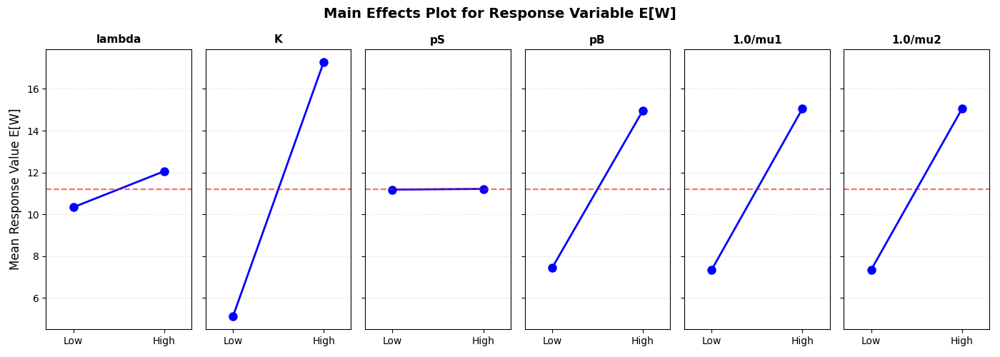
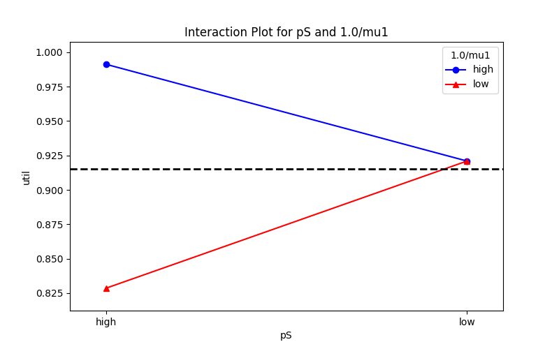

# pes_doe
This repo containss scripts for generating, analyzing, and plotting analysis results presented in a lecture on design of experiments.

The system studied is illustrated below.


Jobs arrive in a Poisson process with rate $\lambda$ to a queue with maximum capacity K jobs. When a job goes into service, with probability pS the service time is drawn from an exponential distribution with mean $1.0/\mu_1$, it is otherwise drawn as the constant $1.0/\mu_2$.   On completing service the job branches back to the entry of the queue with probability pB, and otherwise departs.

A full factorial design of experiments is explored, using the high and low assignments given in the table below.


| Factor      | Low Value | High Value |
| ----------- | --------- | ---------- |
| $\lambda$   | 1.0       | 5.0        |
| K           | 3         | 10         |
| pB          | 0.05      | 0.5        |
| pS          | 0.0       | 1.0        |
| $1.0/\mu_1$ | 0.5       | 2.0        |
| $1.0/\mu_2$ | 0.5       | 2.0        |

This encoding is described in file gen_arg.json

```
{
    "-arrival_rate": [
        1.0,
        5.0
    ],
    "-termination": [
        100000
    ],
    "-K": [
        3,
        10
    ],
    "-seed": [
        624356
    ],
    "-pB": [
        0.05,
        0.5
    ],
    "-pS": [
        0.0,
        1.0
    ],
    "-inv_mu1": [
        0.5,
        2.0
    ],
    "-inv_mu2": [
        0.5,
        2.0
    ],
    "-skip": [
        0.25
    ],
    "-batches": [
        25
    ]
}

```

Here the dictionary keys are command line arguments for the simulator, and those keys that have lists with two elements are factors, with the first element of the list being the 'low' value of the factor and the second element being the 'high' value.

Script gen_sim.py is run as 

```
% python gen_sim.py gen_args.json
```

gen_sim.py requires that the 'itertools' package be imported; it calls a script that runs the simulation, a script which requires that package scipy be installed, and assumes that the pyevtsim package be found in a peer directory of pes_doe.

Running gen_sim.py as above works through all combinations of assignments of list member values to dictionary keys in gen_args.json . With each assignment it creates an input file 'args' of command line argument assignments, and runs the script 'main.py' on it.   main.py uses batch means to construct confidence intervals around the mean number of jobs in the system (E[N]), the mean time a job spends in the system (E[W]), the server utilization ($\rho$), and the probability that an arriving job is dropped because the system is full (Pr{drop}).  After a run, these confidence intervals and the input arguments that gave rise to them are put into a json record that is then appended to a list of such records in file output.json .

After the execution of gen_sim.py is complete one can generate plots that analyze the results.  Running

```
python3 means-plot.py gen_args.json output.ps
```

will create in the pes_doe directory the files 'mean-plot-N.png', 'mean-plot-W.png', 'mean-plot-rho.pn', and 'mean-plot-prdrop.png', each of which provides a standard 'Means Plot' of the influence of one factor.   An example for E[W] is given below.





Running 

```
python3 interaction-plot.py gen_args.json output.ps
```

produces images 'interact-N.png', 'interact-W.png', 'interact-rho.pn', and 'interact-prdrop.png' describing the interaction of factors pS and $1.0/mu_1$.  This script requires that package statsmodels be installed before running.   Each of the images is of an 'Interaction Plot', an example of interact-rho.pn' being given below




